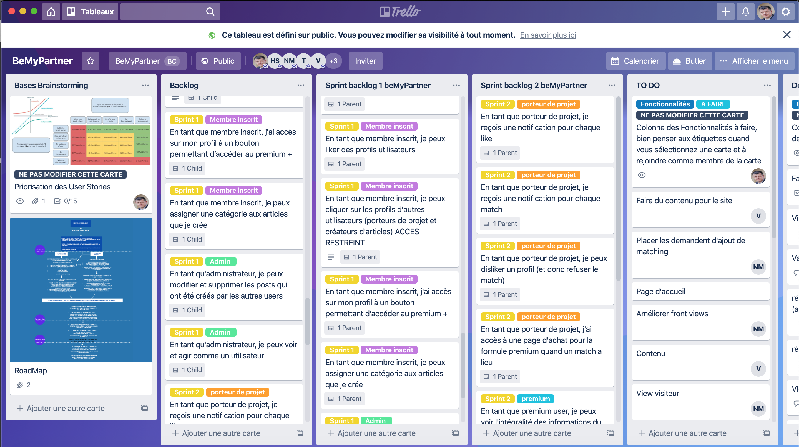
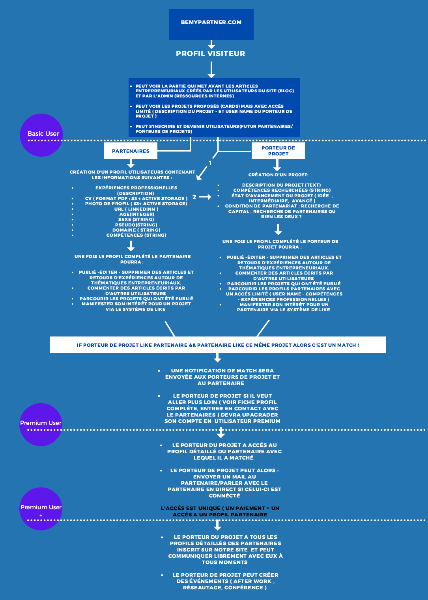
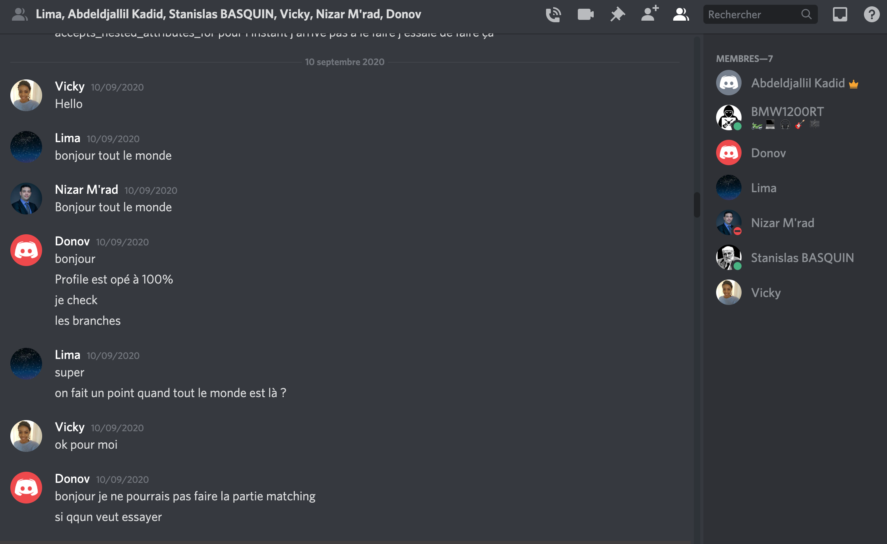

# BeMyPartner

BeMyPartner is a plateforme designed to facilitate collaborations between entrepreneurs who are looking for partners to work with, and  specialists (in any field of competence) who want to take part in a project. 
The goal is to help project initiators to pass above one of the problems they may face  to develop their projects : the lack of competences and the search of reliables partners. In the same time, some people who have interesting skills may want to start an entrepreneurial advenure, without having a project or a team.
let's make them meet !

# Table of contents

 * Technologies
 * Installation
 * Features
 * Visuals
 * Authors and acknowledgment

## Technologies

 * Ruby 2.7.1
 * Rails 5.2.4.3
 * Javascript 
 * Bootstrap 
 * HTML 
 * CSS
 * API : Stripe et Sendgrid
 * some of the Gems used : Devise, Stripe, Jquery-rails, Dotenv-rails, Redis ...

 ## Installation 

 To run this project : bundle install, rails db:create, rails db:migrate
 Github : https://github.com/NizarMrad/BeMyPartner/tree/master
 Heroku : https://bemypartner-production.herokuapp.com/

## Features

Visitors can sign up and become users with a profile they create. They receive an e-mail when their profile is created.
Users can submit articles and projects. All users can comment an article.
Users can manifest their interest for a project or a profile with a like. If two users like their project and profile, they are both notified, thanks to the matchmaker service. 
Users can have acces to more functionnalities with a paiement on the plateform.
Users can exchange messages through the messaging service and have acces to the full profil of each others. 

## Visuals

## Authors and acknowledgment
* M'RAD Nizar : https://github.com/NizarMrad
* SPIRIDONOV Timour : https://github.com/LeDjinn
* KADID Abdeldjallil : https://github.com/AleaToir3
* CHERIK Halima : https://github.com/Halima-C
* LUCEA Vicky : https://github.com/VickyMayLee
* Mentor : Jean-Marc Dardy

